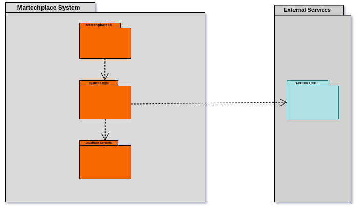
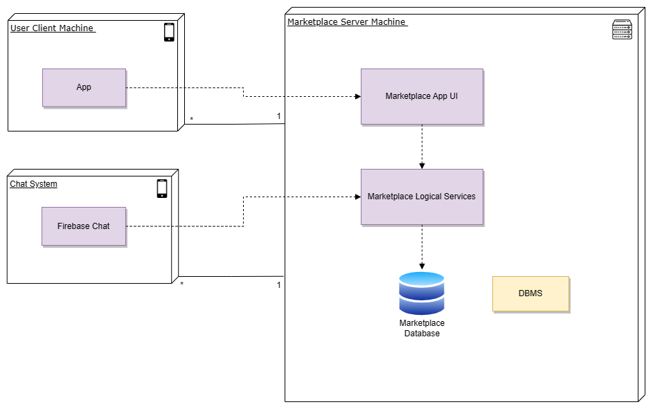

# L.EIC Software Engineering Project - 2LEIC13T1

The L.EIC MarTechPlace project was developed for the Software Engineering course in the 2023/24 academic year of the 2nd year of L.EIC at FEUP.

## Project Description

Our product addresses the pressing needs of the academic community by offering affordable electronic devices, crucial tools often required for their coursework. Simultaneously, it aims to meet the growing demand for sustainability in our society. With alarming rates of electronic waste, it is our responsibility to take action through prevention, reduction, recycling, and reuse initiatives.

## Vision

Connecting Porto Academic Community through technology reuse for a sustainable future.

## Target Group

Porto's Academic Community.

## General Objectives

- Facilitate the reuse of electronic devices among students.
- Promote sustainability within the academic community.
- Promover uma culture of solidarity and resourcefulness.

## Features

1. Create account and profile - Users can register and manager their profiles.

2. Browse and search devices - Enable users to easily find and filter desired devices.

3. Post and manage ads - Allow users to list devices for sale and manage their listings.

4. Messaging in a safer way - Facilitate secure communication between buyers and sellers.  

5. Report inappropriate content - Maintain a safe and trustworthy platform.

## Requirements

### Domain Model

  

  <b><i>Domain Model</i></b>

In the domain model, a User can have multiples Ads, within this Ads it can have one Category. The Message happens between two Users, and a User can have many Messages.

### Logical Design

  

  <b><i>Logical Architecture</i></b>

The Marketplace UI communicate with the system Logic, which if needed can access the database within the system or access the chat service, which is a external service.

### Physical Design 

  

  <b><i>Physical Architecture</i></b>

Users can access the app via their cellphones, enabling communication between the app and the server over the internet. The server facilitates data storage and retrieval by interfacing with the database. Additionally, the chat service, integrated into the Marketplace server but not in it, facilitating user-to-user communication.

## Dependencies

- Basic Search and Filtering functionalities.
- User Authentication in a secure way and account validation / approval mechanisms (optional).
- Integration of a gateway for payment (optional).

## Sustainable Development Goals

- SDG 12: Responsible Consumption and Production (Primary focus).
- SDG 4: Quality Education (Secondary focus).
- SDG 11: Sustainable Cities and Communities (Secondary focus).

