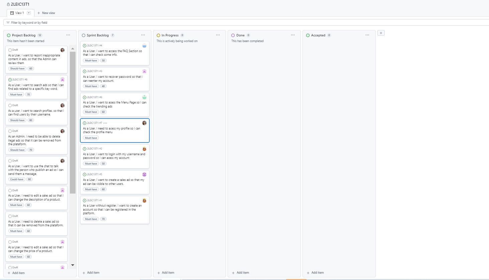
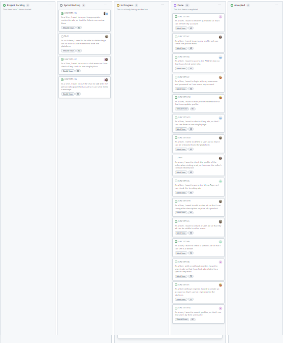
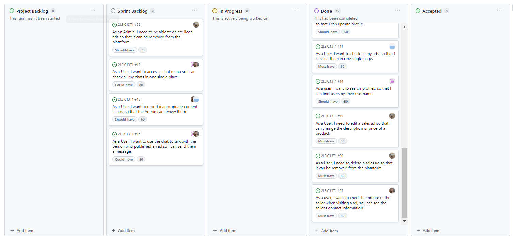

# Martechplace

A new Flutter project.

## Getting Started

FlutterFlow projects are built to run on the Flutter _stable_ release.

## Integration Tests

To test on a real iOS / Android device, first connect the device and run the following command from the root of the project:

```bash
flutter test integration_test/test.dart
```

To test on a web browser, first launch `chromedriver` as follows:
```bash
chromedriver --port=4444
```

Then from the root of the project, run the following command:
```bash
flutter drive \
  --driver=test_driver/integration_test.dart \
  --target=integration_test/test.dart \
  -d chrome
```

Find more information about running Flutter integration tests [here](https://docs.flutter.dev/cookbook/testing/integration/introduction#5-run-the-integration-test).

Refer to this guide for instructions on running the tests on [Firebase Test Lab](https://github.com/flutter/flutter/tree/main/packages/integration_test#firebase-test-lab).
=======
# L.EIC Software Engineering Project - 2LEIC13T1

The L.EIC MarTechPlace project was developed for the Software Engineering course in the 2023/24 academic year of the 2nd year of L.EIC at FEUP.

## Project Vision

Our project envisions connecting the Porto Academic Community through technology reuse for a sustainable future, addressing pressing needs for affordable electronic devices while promoting sustainability and fostering a culture of solidarity and resourcefulness within the academic community. To achieve this, we aim to facilitate the reuse of electronic devices among students and promote sustainability through prevention, reduction, recycling, and reuse initiatives, thereby promoting a culture of solidarity and resourcefulness.

## Target Group

Porto's Academic Community.

## Features


1. Create account and profile - Users can register and manager their profiles.

2. Browse and search devices - Enable users to easily find and filter desired devices.

3. Post and manage ads - Allow users to list devices for sale and manage their listings.

4. Messaging in a safer way - Facilitate secure communication between buyers and sellers.  

5. Report inappropriate content - Maintain a safe and trustworthy platform.

## Requirements

### Domain Model

<p align="center" justify="center">
  
</p>
<p align="center">
  <b><i>Domain Model</i></b>
</p>

In the domain model, a Web User is identified by their username and password. Each Web User is related to a real User, from whom we must know the name and contact information. Users can share messages between themselves and can have Ads. A User can report an Ad if it contains inappropriate content. An Admin is a special User that can check those reports and deal with the situation.

### Logical Design

<p align="center" justify="center">
  
</p>
<p align="center">
  <b><i>Logical Architecture</i></b>
</p>

The Marketplace UI communicate with the system Logic, which if needed can access the database within the system or access the chat service, which is a external service.

### Physical Design 

<p align="center" justify="center">
  
</p>
<p align="center">
  <b><i>Physical Architecture</i></b>
</p>


Users can access the app via their cellphones, enabling communication between the app and the server over the internet. The server facilitates data storage and retrieval by interfacing with the database. Additionally, the chat service, integrated into the Marketplace server but not in it, facilitating user-to-user communication.

## Dependencies

- Basic Search and Filtering functionalities.
- User Authentication in a secure way and account validation / approval mechanisms (optional).
- Integration of a gateway for payment (optional).

## Sustainable Development Goals

- SDG 12: Responsible Consumption and Production (Primary focus).
- SDG 4: Quality Education (Secondary focus).
- SDG 11: Sustainable Cities and Communities (Secondary focus).

### Section 1 

## Beginning of Sprint 1
<p align="center" justify="center">
  
</p>
<p align="center">
  <b><i> Backlog of the Beginning of Sprint 1</i></b>
</p>


## End of Sprint 1
<p align="center" justify="center">
  
</p>
<p align="center">
  <b><i> Backlog of the End of Sprint 1</i></b>
</p>


As the main difficulties during the sprint, we highlight learning to use the programming tool (FlutterFlow) and creating the pages with the functionalities we described in the user stories, configuring our project with the Firebase API, and creating the tests, which were not working even at the end of the sprint. Our communication channel via WhatsApp was of great help during the sprint, although not all members of the group were as communicative. We are pleased to have most of the pages implemented and functional.

## ChangeLog

- Implementation of [Menu Page](https://github.com/FEUP-LEIC-ES-2023-24/2LEIC13T1/issues/6)
- Implementation of [Sign In Page](https://github.com/FEUP-LEIC-ES-2023-24/2LEIC13T1/issues/2)
- Implementation of [Register Page](https://github.com/FEUP-LEIC-ES-2023-24/2LEIC13T1/issues/1) 
- Implementation of [Recover Password Page](https://github.com/FEUP-LEIC-ES-2023-24/2LEIC13T1/issues/3)
- Implementation of [Profile Menu Page](https://github.com/FEUP-LEIC-ES-2023-24/2LEIC13T1/issues/7)
- Implementation of [Create Sales Ad Page](https://github.com/FEUP-LEIC-ES-2023-24/2LEIC13T1/issues/5)

All of the above were implemented using databases and the firebase authentication tool for funcionalities such as Login, Register and Recover Password. Our main difficulty was to implement the unit and acceptance tests, that have not been fully implemented in this Sprint

## Beginning of Sprint 2
<p align="center" justify="center">
  
</p>
<p align="center">
  <b><i> Backlog of the Beggining of Sprint 2</i></b>
</p>

## ChangeLog
- Implementation of [Search Products Page](https://github.com/FEUP-LEIC-ES-2023-24/2LEIC13T1/issues/8)
- Implementation of [Edit Ad Page](https://github.com/FEUP-LEIC-ES-2023-24/2LEIC13T1/issues/19)
- Implementation of [Ad Details Page](https://github.com/FEUP-LEIC-ES-2023-24/2LEIC13T1/issues/9)
- Implementation of [FAQ Section Page](https://github.com/FEUP-LEIC-ES-2023-24/2LEIC13T1/issues/4)
- Implementation of [My Ads Page](https://github.com/FEUP-LEIC-ES-2023-24/2LEIC13T1/issues/11)
- Implementation of [Delete Ads Page](https://github.com/FEUP-LEIC-ES-2023-24/2LEIC13T1/issues/20)
- Implementation of [Edit Profile Page](https://github.com/FEUP-LEIC-ES-2023-24/2LEIC13T1/issues/10)

## End of Sprint 2
<p align="center" justify="center">
  
</p>
<p align="center">
  <b><i>Backlog of the End of Sprint 2</i></b>
</p>
One of the main hurdles was configuring our project with the Firebase API. Integrating Firebase effectively required substantial effort and troubleshooting, which impacted our progress. Moreover, creating and executing tests proved to be a persistent issue. Despite our efforts, the tests were not functioning correctly by the end of the sprint.

## Beggining of final Sprint

<p align="center" justify="center">
  
</p>
<p align="center">
  <b><i> Backlog of the Beggining of Final Sprint</i></b>
</p>

## ChangeLog
- Implementation of [Chats](https://github.com/FEUP-LEIC-ES-2023-24/2LEIC13T1/issues/16)
- Implementation of [Chat Menu](https://github.com/FEUP-LEIC-ES-2023-24/2LEIC13T1/issues/17)
- Implementation of [Delete Ilegal Items](https://github.com/FEUP-LEIC-ES-2023-24/2LEIC13T1/issues/22)
- Implementation of [Report innapropriate items](https://github.com/FEUP-LEIC-ES-2023-24/2LEIC13T1/issues/15)
- Implementation of Widget Tests, in (integration_test/widget_test.dart).
- Implementation of Integration Tests, in (integration_test/test.dart).

## End of final Sprint

<p align="center" justify="center">
  
</p>
<p align="center">
  <b><i> Backlog of the End of Final Sprint</i></b>
</p>

The main difficulty of this sprint was definitely implementing the chat feature. It was a complex task, but we made it work. Additionally, the tests posed a challenge, but we managed to improve them as well.
